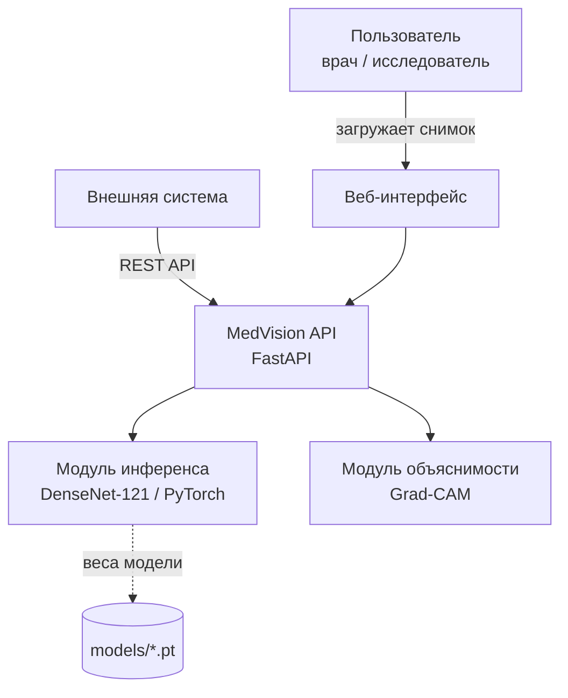
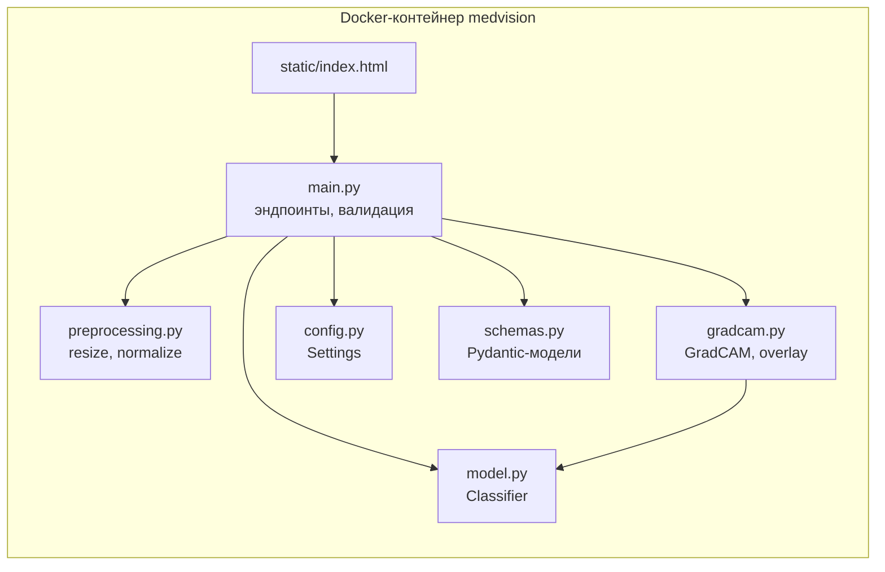
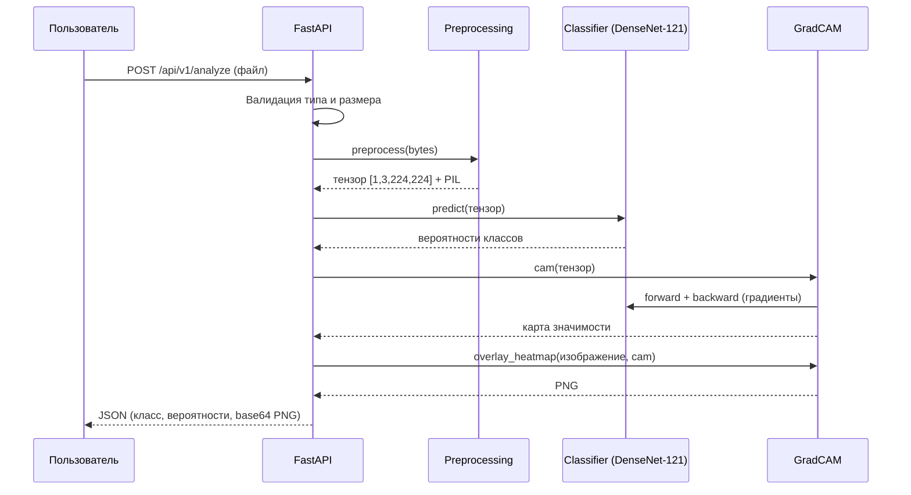

# Архитектура системы MedVision

## Контекстная диаграмма (C4, уровень 1)

## Компонентная диаграмма (C4, уровень 3)

## Последовательность обработки запроса /api/v1/analyze

## Принципы Grad-CAM

1. Прямой проход: сохраняются активации последнего свёрточного блока `denseblock4`.
2. Обратный проход от логита целевого класса: сохраняются градиенты по этим активациям.
3. Веса каналов — глобальное усреднение градиентов (alpha_k).
4. Карта = ReLU(сумма взвешенных активаций), нормализация в [0, 1], масштабирование до размера входа.

## Ключевые архитектурные решения

| Решение | Обоснование |
|---|---|
| DenseNet-121 | Стандарт де-факто для рентгенограмм (CheXNet); плотные связи улучшают градиентный поток |
| FastAPI | Асинхронность, автодокументация OpenAPI, валидация через Pydantic |
| Загрузка модели в lifespan | Модель загружается один раз при старте, а не на каждый запрос |
| Grad-CAM через hooks | Не требует модификации модели; hooks снимаются после каждого запроса |
| Демо-режим без весов | Сервис запускается без артефактов обучения — упрощает проверку и CI |
| Многоступенчатый Docker | Меньший итоговый образ; запуск от непривилегированного пользователя |

# План работ (по этапам методички)

| Этап | Недели | Содержание | Результат |
|---|---|---|---|
| 1. Организационно-аналитический | 1–2 | Утверждение задания, обзор аналогов (CheXNet, Lunit, Qure.ai), формулирование требований | Задание, аналитический обзор (раздел 1 записки) |
| 2. Проектирование архитектуры | 3–4 | Выбор стека (Python+PyTorch+FastAPI), C4/sequence-диаграммы, API-контракт | Этот документ, раздел 2 записки |
| 3. Разработка ядра | 5–7 | Репозиторий (Git flow), preprocessing, Classifier, базовые тесты | Рабочий прототип, GitHub |
| 4. Полная функциональность | 8–9 | Grad-CAM, веб-интерфейс, эндпоинт /analyze, обучение модели | Готовый продукт |
| 5. Тестирование и безопасность | 10–11 | pytest + покрытие, ruff, bandit (SAST), pip-audit (SCA) | Отчёты, исправленные дефекты |
| 6. Документирование | 12 | Пояснительная записка, README, презентация, предзащита | Полный комплект документов |
| 7. Защита | сессия | Демонстрация, ответы на вопросы | Оценка |
